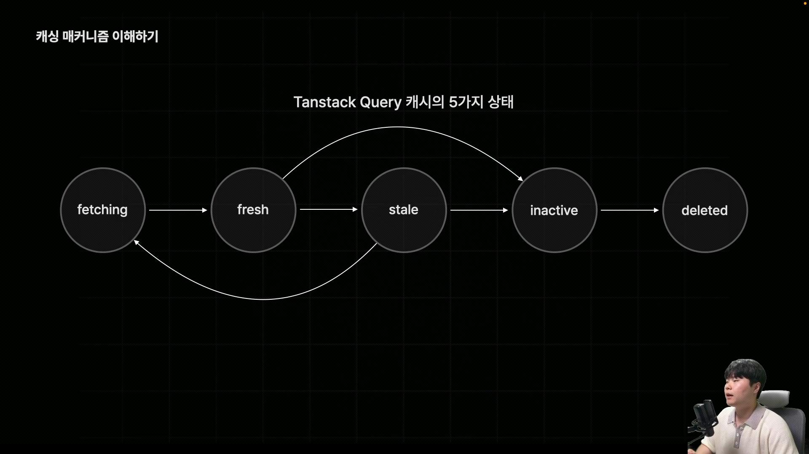

# React 앱의 상태 분류

• 지역 상태 : 특정범위에서만 접근 가능

- 인풋 태그의 사용자 입력 값
  • 전역 상태 : 전체 컴포넌트에서 접근 가능
- 앱의 테마 데이터, 세션 정보 데이터

• API의 요청과 관련된 데이터들은 직접 관리해야 되는 데이터의 가짓수가 너무 많아
Zustand를 활용해 전역으로 관리하기엔 무리가 있음
• 그렇다고 지역 상태로 관리하기엔 여러 컴포넌트에서 데이터에 접근하기가 어려움, 코드도 복잡해짐
• 실무에서는 보통 **서버 상태** 유형으로 관리함
• 서버 상태 관리를 위한 라이브러리인 **TanStack Query**를 사용한다.


## 실습용 서버 실행

```bash
npm i json-server -D
npx json-server server/db.json [실행]
```

## TanStack Query

```bash
npm i @tanstack/react-querybash
```

```jsx
// example
export default function Component() {
    const {data, isLoading, error} = useQuery(...);
    if(error) return <div>오류 발생</div>
    if(isLoading) return <div>로딩 중 입니다..</div>
    return <div>{data}</div>
}
```

• 요청이 실패 했을 때 **retry**라는 옵션을 통해 다시 한번 요청을 보낼 수도 있고
캐시값을 이용해 중복 요청을 방지하는 등의 서버 상태 관리를 위한 굉장히 다양한 기능들이 제공된다.
• TanStack Query는 비동기 요청의 상태를 매우 편리하게 관리하도록 도와주는 다양한 기능들을 제공하고 있다.

### 데이터 조회 요청관리하기

#### 1. QueryClientProvider 컴포넌트 불러와 main 컴포넌트를 감싸고, client props 넘기기

• **QueryClient** : TanStack Query를 이용해서 관리하는 모든 서버 상태를 보관하는 스토어 개념
API 응답값, 캐싱 값, 캐시 옵션들 등 다양한 값들이 보관됨

```tsx
...
import { QueryClientProvider, QueryClient } from '@tanstack/react-query';


const queryClient = new QueryClient(); // TanStack Query를 이용해서 관리하는 모든 서버 상태를 보관하는 일종의 스토어 개념
createRoot(document.getElementById('root')!).render(
  <BrowserRouter>
    <QueryClientProvider client={queryClient}>
      <App />
    </QueryClientProvider>
  </BrowserRouter>
);
```

#### 2. 백엔드 서버에서 제공하는 데이터 가져오기

```tsx
/**TodolistPage.tsx
 * 🙀 TanStack Query 적용 전 코드 */

async function fetchTodos() {
  const res = await fetch('http://localhost:3000/todos');
  if (!res.ok) throw new Error('err');

  const data: Todo[] = res.json();
  return data;
}

export default function TodoListPage() {
  const [todos, setTodos] = useState<Todo[]>([]);
  const [isLoading, setIsLoading] = useState(false);
  const [error, setError] = useState();

  const fetchData = async () => {
    setIsLoading(true);
    try {
      const data = await fetchTodos();
      setTodos(data);
    } catch (err) {
    } finally {
      setIsLoading(false);
    }
  };

  useEffect(() => {
    fetchData();
  }, []);
}
```

```tsx
/**
 * TanStack Query 적용 후 코드
 */

import { useQuery } from '@tanstack/react-query';

export default function TodoListPage() {
  // useQuery hook이 컴포넌트가 마운트 되었을때 queryFn으로 설정한 함수를 자동으로 호출하고 queryKey의 이름으로 저장함

  // 반환값으로는 data(fetch res) , isLoadingg(fetchLoading상태), error 등등 자동으로 제공
  const {
    data: todos,
    isLoading,
    error,
  } = useQuery({
    queryFn: fetchTodos, // 만들었던 fetch함수 전달
    queryKey: ['todos'],
    // TanStack Query 자동 재시도 기능 설정 (기본값으로 3번실행됨)
    // retry: 0
  });

  if (error) return <div>error</div>;
  if (isLoading) return <div>Loading...</div>;
  return (
    <div>
      {todos.map((todo) => (
        <TodoItem {...todo}></TodoItem>
      ))}
    </div>
  );
}
```

#### 3. fetch 함수 · TanStack Query 분리하기

• fetch 함수는 src/api/fetchTodos.ts 로 분리
• useQuery src/hooks/quries/useTodos.data.ts 로 custom hook으로 분리

```tsx
/**src/hooks/quries/useTodos.data.ts */
import { fetchTodos } from '@/api/fetchTodos';
import { useQuery } from '@tanstack/react-query';

// useTodoData를 호출하면 자동으로 fetchTodos가 실행되어
// 해당 요청의 상태값을 어디든지 쓸 수 있게 된다.

export function useTodosData() {
  return useQuery({
    queryFn: fetchTodos,
    queryKey: ['todos'],
    // retry: 0, 에러시 재시도 하지 않기
  });
}
```
