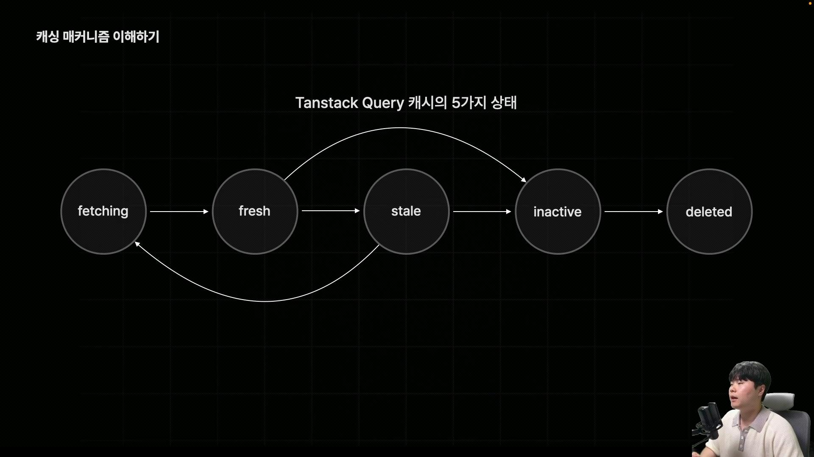
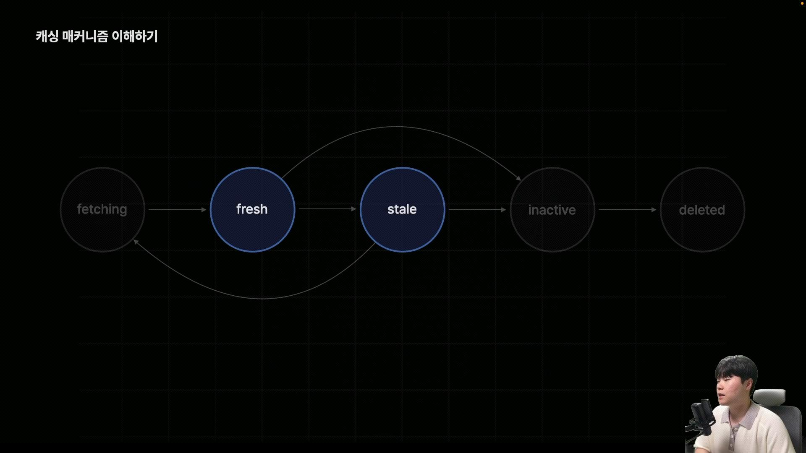
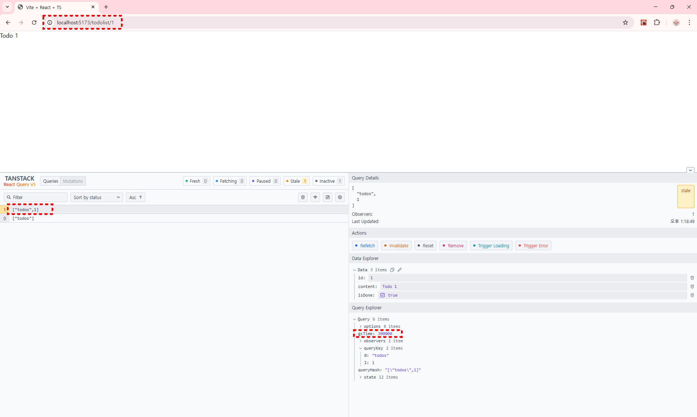

# TanStack Query의 효능

- 자체적인 캐싱 메커니즘인 강력한 캐싱 기능을 이용하여 앱을 최적화
- 적절한 타이밍에 캐시 데이터를 갱신하거나 삭제 가능
- TanStack Query는 사용자에게 최대한 로딩 화면을 덜 보여주는 방식으로 앱의 최적화를 해준다.

# TanStack Query 캐시의 5가지 상태

- fetching
- fresh
- stale
- inactive
- deleted
  

## fetching

- 아직 데이터가 불러와지고 있는 중일때를 의미
- 따로 캐시에 저장된 데이터가 없는 상태

## fresh

- 신선한 데이터 (방금 막 불러온 데이터)

## stale

- 데이터가 상한 상태
- 데이터 유통기한이 지난 상태 (오래된 데이터)

### staleTime

- fresh → stale 까지 가는 시간을 의미함
- 캐시 데이터별로 직접 설정 가능

### refetching

- fetching → fresh → stale → fetching → fresh ....
- 반복되는 순환구조를 의미
- 특정 타이밍에 리패칭의 기능을 키거나 끌 수 있다
  - Mount : 캐시 데이터를 사용하는 컴포넌트가 마운트 되었을 때
  - WindowFocus : 사용자가 이 탭에 다시 돌아왔을 때
  - Reconnect : 인터넷 연결이 끊겼다가 다시 연결 되었을 때
  - Interval : 특정 시간을 주기로

# 캐싱 메커니즘 직접 살펴보기

## devtools 설치

- devtools를 활용하여 TanStack Query가 관리하는 비동기 API 요청 캐시상태를 쉽게 확인 가능
  

```bash
npm i @tanstack/react-query-devtools
```

- main 컴포넌트에서 **ReactQueryDevtools**를 불러와 App컴포넌트를 감싼다.

```tsx
/** main.tsx */
...
import { QueryClientProvider, QueryClient } from '@tanstack/react-query';
import { ReactQueryDevtools } from '@tanstack/react-query-devtools';

// TanStack Query를 이용해서 관리하는 모든 서버 상태를 보관하는 일종의 스토어 개념

const queryClient = new QueryClient();
createRoot(document.getElementById('root')!).render(
  <BrowserRouter>
    <QueryClientProvider client={queryClient}>
      <ReactQueryDevtools />
      <App />
    </QueryClientProvider>
  </BrowserRouter>
);

```

## Query Param 과 TanStack Query

```tsx
/** src > api > fetchTodoaById.ts */
export async function fetchTodoByid(id: number) {
  const res = await fetch(`${API_BASE_URL}/todolist/${id}`);
  if (!res.ok) throw new Error('err');
  const data: Todo = await res.json();
  return data;
}
```

```tsx
/** src > hooks > queries > useTodoDataById.ts */
export function useTodoDataById(id: number) {
  return useQuery({
    queryFn: () => fetchTodoById(id),
    queryKey: ['todos', id],
  });
}
```

- 특정 컴포넌트에서 실행이 되면, fetchTodoById의 데이터를 불러오게 되고,
  ["todos",1]... 형태의 값으로 캐싱이 됨

```tsx
/** TodoDetailPage */
import { useTodoDataById } from '@/hooks/quries/useTodoDataById';
import { useParams } from 'react-router';

export default function TodoDetailPage() {
  const params = useParams();
  const id = params.id;

  const { data, isLoading, error } = useTodoDataById(Number(id));
  if (isLoading) return <div>로딩중 입니다...</div>;
  if (error) return <div>오류가 발생했습니다!</div>;
  return (
    <>
      <h1>{data?.content}</h1>
    </>
  );
}
```

## 리패칭 적용 시간 변경

- 데이터의 상태가 stale로 변하는 시간이 기본 0초로 설정됨
- stale상태가 되면 특정 타이밍에 다시 리패칭 발생
  - 다시 그 페이지 접속시 리패칭
  - 윈도우포커스, 새로운탭 다른곳 클릭후 다시 돌아와도 리패칭
  - 인터넷 연결 끊겼다가 다시 연결되는 리커넥트 시점에도 리패칭
  - 마운트 시점에 다시 리패칭이 실행됨

### 원하는 시점에 리패칭 되도록 설정하는 옵션들

```tsx
export function useTodoDataById(id: number) {
  return useQuery({
    queryFn: () => fetchTodoById(id),
    queryKey: ['todos', id],

    staleTime: 5000, // → stale까지 되는 시간 (초단위로 설정)
    refetchInterval: 1000, // → 1초마다 리패칭
    refetchOnMount: false, // → stale 상태가 되어도 리패칭 진행 안함
    refetchOnWindowFocus: false, // → 윈도우 포커스 시점에서도 리패칭 되지 않도록함
    refetchOnReconnect: false, // → 연결이 끊어졌다가 다시 되는 reconnect 시점에 리패칭 되지 않도록 함
    refetchInterval: false, // → 주기적 리패칭하지 않도록 함
  });
}
```

## stale 상태

- stale로 변해버린 캐시 데이터는 아예 사용이 되지 않는건 아님
- TanStack Query에서는 stale상태로 변했을때 뒤로가기 했다가 다시 돌아왔을때
  리패칭을 통해 새로운 데이터를 불러올때까지 로딩창을 보여주는게 아닌,
  사용자가 기다리지 않도록 먼저 stale된 캐시 데이터를 보여주고 백그라운드에서 리패칭이 일어남
- 데이터패칭이 완료되면 기존의 데이터를 새로운 데이터로 교체해 데이터를 보여주게 됨

## freash → inactive



- 브라우저 화면상에 캐시데이터를 사용하는 컴포넌트가 단 하나도 존재하지 않음
- TanStack Query의 캐시 데이터는 fresh상태나 stale상태에 있던
  해당 데이터를 사용하는 컴포넌트가 없다면 Inactive 상태로 전환이 된다.
- active되어 있지 않은 상태 즉 캐시 데이터가 현재 사용되고 있지 않은 상태를 의미하는 거기 때문에
  많아서 좋을게 없음, 메모리 낭비로 이어짐
- 이런Inactive 데이터를 쓰레기를 치우는 타임의 뜻인 **Garbage Collecting Time (gc time)** 시간이 지나게 되면
  deleted 상태로 전환이 되면서 메모리에서 아예 삭제가 되어버림

## gc time 설정하기



- inactive 상태가 되면 gc 타임으로 설정된 시간 이후에 \*사진상으로는 5분 이후
  deleted 상태로 전환되어 사라지게 됨

```tsx
export function useTodoDataById(id: number) {
  return useQuery({
    queryFn: () => fetchTodoById(id),
    queryKey: ['todos', id],

    staleTime: 5000, //fresh 상태에서 stale까지 되는 시간
    gcTime: 5000, // gcTime 설정 * inactive 상태에서 5초지나면 자동 삭제
  });
}
```

- staleTime은 fresh상태에서만 유효, gcTime은 inactive 상태에서만 유효하기때문에 별개의 상황에서 동작함

## 캐싱 메커니즘 전역 설정

- QueryClient의 인수로 defaultOptions 설정

```tsx
import { createRoot } from 'react-dom/client';
import App from './App.tsx';
import './index.css';
import { BrowserRouter } from 'react-router';
import { QueryClientProvider, QueryClient } from '@tanstack/react-query';
import { ReactQueryDevtools } from '@tanstack/react-query-devtools';

// TanStack Query를 이용해서 관리하는 모든 서버 상태를 보관하는 일종의 스토어 개념
const queryClient = new QueryClient({
  defaultOptions: {
    queries: {
      staleTime: 0, // useQuery로 관리되는 모든 캐시데이터는 0초로 설정이 됨
      gcTime: 5 * 60 * 1000, // gcTime 5분으로 설정
    },
  },
});
createRoot(document.getElementById('root')!).render(
  <BrowserRouter>
    <QueryClientProvider client={queryClient}>
      <ReactQueryDevtools />
      <App />
    </QueryClientProvider>
  </BrowserRouter>
);
```

- staleTime을 디폴트 값을 0초로 설정하는게 대부분인데,
  개발을 진행할때에는 캐시를 최소화 해서 동작시키는게 훨씬 편리함
- 서버로부터 데이터를 불러오자마자 stale상태로 만들어 사용자가 페이지에 새롭게 방문할 때마다 언제다 다시 리패칭되도록 설정
- gcTime은 길게 설정해주는 이유는 캐시 데이터를 실제로 제거하는 시간이기 때문에, 미리 보여주기용으로 사용되는 stale 데이터를
  바로 메모리에서 삭제하지 않게 해야하는 이유이다.
- 개인옵션 설정 값이 전역 설정값보다 우선순위이다.
